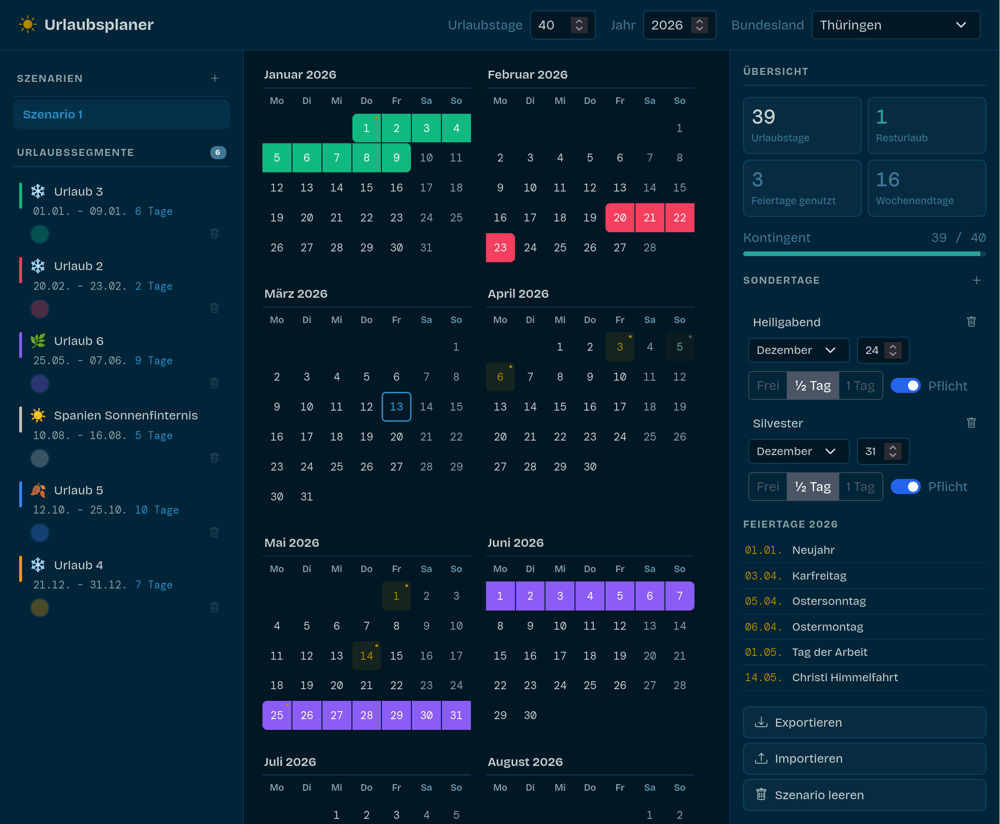

# Urlaubstageplaner

Kleines Tool zur Planung, Visualisierung und Optimierung von Urlaubstagen direkt im Browser.



## Features

- Jahreskalender mit Urlaubssegmenten
- Mehrere Szenarien anlegen und vergleichen
- Berücksichtigung Feiertage je Bundesland
- Berücksichtigung Sondertage konfigurieren (z.B. Heiligabend, Silvester als halber oder freier Tag oder Tag an dem zwingenden Urlaub zu nehmen ist)
- Anzeige verbrauchte und verbleibende Urlaubstage
- Export und Import als JSON

## Entwicklung

```bash
npm start
```

Öffne `http://localhost:4200/`.

## Build

```bash
npm run build
```

## Lizenz

[CC BY 4.0](https://creativecommons.org/licenses/by/4.0/)
